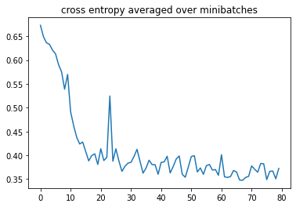

# Detecting Software Design Issues with Graph NN 

__Subject__: Final Project proposal for master’s degree.  
__Name__: Kfir Yehezkel  
__ID__: 032426181  
__Email__: kfir.ye@gmail.com  
__Graduation Supervisor__: Prof. Iakov Exman  

## Abstract

...

## Background

...

## Introduction 

Writing computer software is a creative activity and Programmers are not bounded by practical limitations such as the laws of physics. Programming does not require great physical skill or coordination however it requires creative mind and the ability to organize thoughts. If one can visualize a system, one can probably implement it in a computer program. Nowadays a person carrying the job title “software engineer” carries a computer installed with development tools such as compiler, code editors, debuggers, version control clients, and testing framework. Every Software engineer is familiar with object-oriented techniques, algorithm, and few design patterns. Picturing a day in life of Software engineer, software design is still something that is largely untouched. To Emphasize, how many developers masters the SOLID fundamentals? and from those who does, how many of them will raise an issue in early stages that concern Open/Close principle or lack of abstraction. Even though when does, is it really something that business management considers as a tech debt and not as a shows stopper.  . A typical Software team performance indicators are usual external software quality (e.g. Bugs count) and velocity, none of them deals with Design quality.

## The Problem

 >The gap between the best software engineering practice and the average practice is very wide—perhaps wider than in any other engineering discipline. A tool that disseminates good practice would be important  (Fred Brook, The mythical man-month, 1975).  

Although the exponential growth of software engineers, software tools and frameworks in the last 50 years, how amazing it is to find out that Fred Brooks quotes are still relevant. 
Many books of software engineering discipline were written throughout the years, and each one of them dealt with software design, and design approaches, most of them dealt with that question by offering design patterns and practice approaches. The design review practice comes up in any approach, in which a given design will be reviewed by a fellow engineer/architect and based on feedback the design can be modified and reviewed again until converged. Needless to say that Design review is subject to the reviewer bias, experience, and opinions not to say prejudges. When design review is conducted by more than two architects, you are guaranteed to have a difference of opinion, and for sure more questions will be raised than the questions answered. An analysis paralysis outcome from a two hour of design review is a frequent phenomena. Considerable research been directed toward metrics for general software quality and one of the pillars is Design Quality. In fact the metric for design is impractical hence it may be applied only on an existing code and  cannot be applied on the software design portion only. 

## The Method

Deep Learning techniques have been evolved remarkably Recently. In the last years we are witnessing that deep learning techniques outperform the traditional hand-crafted designed algorithm for image recognition, machine translation, game playing and more. The method proposed here suggest harnessing deep learning techniques for software design assessment process. Clearly before we can assess the design a way to model it will be required as a preliminary process. Following the novel works of Exman, a software design can be represent by a simple algebraic notation of modularity matrix.
The modularity metrics is practically a graph adjutancy matrix. Using the intuition of viewing the matrix as a monochrome picture, the famous CNN which dominates the literature of image classification and segmentation tasks is the  straight forward way to give insight. In short, the idea of convolution on an image is to sum the neighboring pixels around a center pixel. Although the adjacency matrix is a two-dimensional array which intuitively can be view as an image, we cannot argue that it is an image. The quick proof would be to take an adjutancy matrix and apply column or row swap, the result adjutancy matrix is equal, that represent the same graph. Images with swapped rows or columns definitely are not equal and thus a CNN for assessing design would be inappropriate .  

CNN adopts the idea by aggregate the features of neighboring nodes into the center node. Graph Neural Network (GNN)  adopts the same idea by aggregate the features of neighboring nodes into the center node. This type of GNN has a very strong mathematics foundation of signal processing spectral analysis. 

Assuming a design can be represented as a Graph, and with a given set of technics of a GNN we would try to find out how to remove dependencies between nodes such that a more cleared module will be presented. 

## Preliminary testing

Several milestone needed to be tested and achieved before we can prove the full scale GNN technique that indicate a module outlier. 
1. Check whether the GNN identifies a bi-partite Graph. 
1. Modifying an almost bi-partite graph into a bi-partite graph removing some edges
1. Given a bi-partite that represent a software design, remove edges from it such that the new bi-partite graph represents a better modular design.

The out of the box solution GNN DGL.ai library is selected for our task. Needless to say that although we have an state of the art solution for GNN, our work can start only after an understanding which problem we are dealing in terms of Graphs theory. Since we selected a Machine learning technique, A mandatory step before executing is to present example to our Learning Machine. To do so we require to come up with a dataset that represent our problem. That data should be sampled wisely and it should be large enough for our GNN to gain good accuracy but not too large, since we want that our GNN training will be done in a reasonable time. 

Understanding that the first defined milestone is a simple Graph classification problem, in which two types of graphs are presented to the GNN: a bi-partite and a non-bi-partite graphs. Generating a non-bipartite is rather easy by using a simple random function, that will be eventually create a binary matrix. a bi-partite graph is also an easy task since its adjacency matrix takes the form of:

A quadrant B matrix can be generated same as before and filling it with zeros and B' accordingly. 

from the method above a dataset were created for training and validating purposes. The training process code were taken from the examples provided with DGL.AI library in which a graph classification were demonstrated. the process includes taking a batch in each training epoch, and that propagate it into the GNN, calculate the loss and back propagate in order to train the GNN parameters. 

## Preliminary Results

The following graph depict loss drop during the training process, it can be seen that it took 80 epoch of in order to gain a convergence. 

Accuracy of predictions on the test set: 82%
Accuracy of predication on the validation set: 78%

## references 

1.	I. Exman , Linear Software Models: Standard Modularity Highlights Residual Coupling , World Scientific Publishing Company.
1.	Steve M. McConnell - Code Complete (1993)
1.	code2vec:Learning Distributed Representations of Code: http://www.cs.technion.ac.il/~mbs/publications/code2vec-popl19.pdf
1.	John Guttag & Barbara Liskov [John Guttag] - Program Development in Java_ Abstraction, Specification, and Object-Oriented Design-Addison-Wesley Professional (2000)
1.	J. K. Blundell, M.L. Hines and J. Stach - The measurement of software design quality: Annals of Software Engineering 4 (1997)
1.	Hans van Vilet, Software Engineering: Principles and Practice, chapter 12 Wiley(2007)

1. Z. Wu, S. Pan, F. Chen, G. Long, C. Zhang, P.S. Yu, A Comprehensive Survey on Graph Neural Networks, https://arxiv.org/abs/1901.00596 (2019)

1. M. Li, M. Wang, Z. Zhang.  Graph Classification Tutorial, https://docs.dgl.ai/en/0.4.x/tutorials/basics/4_batch.html